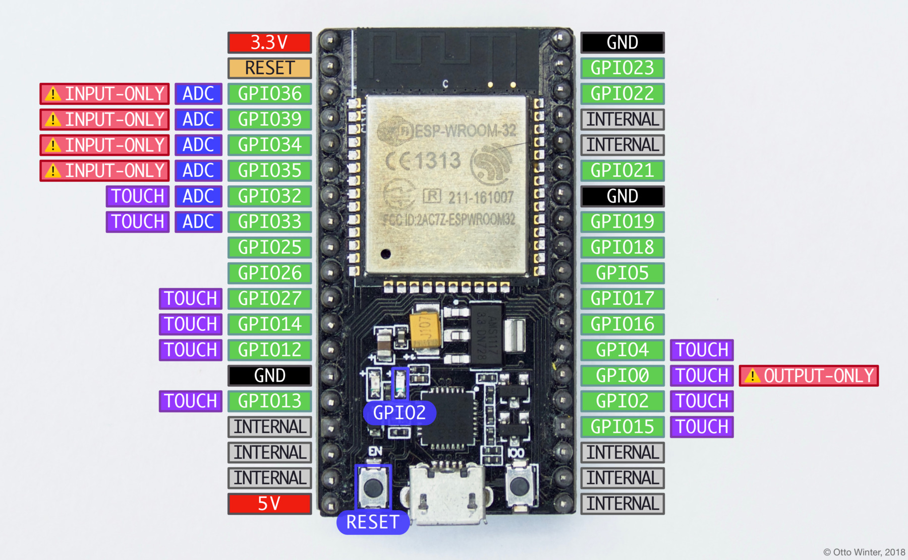

# ESP32 Web Server

## ESP32 NodeMCU v1.1

To upload to this board, wait for the `Connecting....` then press and hold the
boot button, press and release the reset button then release the boot button.

